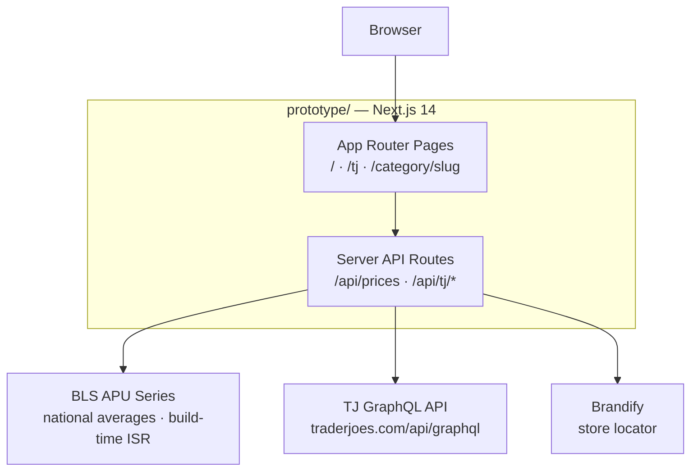
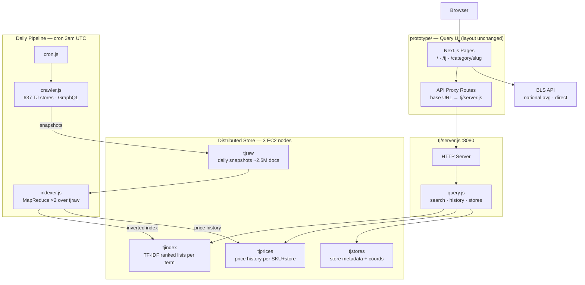
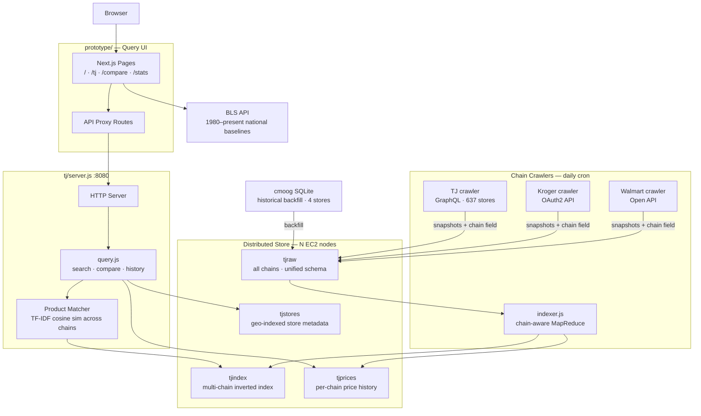

# Price Tracker Migration Plan

## Architecture Diagrams

### Current Architecture

---

### Stage 1 — TJ Daily Snapshots + Distributed Backend

---

### Stage N — Multi-Chain Comparison Engine

---

## Stage Comparison

|                  | Current                       | Stage 1                                    | Stage N                              |
| ---------------- | ----------------------------- | ------------------------------------------ | ------------------------------------ |
| **Data source**  | BLS + live TJ GraphQL         | Distributed store (tjraw/tjindex)          | Multi-chain distributed store        |
| **Prototype changes** | —                        | BASE_URL env var in proxy routes           | Add /compare page                    |
| **New infra**    | —                             | crawler + indexer + tj/server.js           | Per-chain crawlers + product matcher |
| **Hard problem** | —                             | MapReduce key serialization constraints    | Cross-chain product deduplication    |
