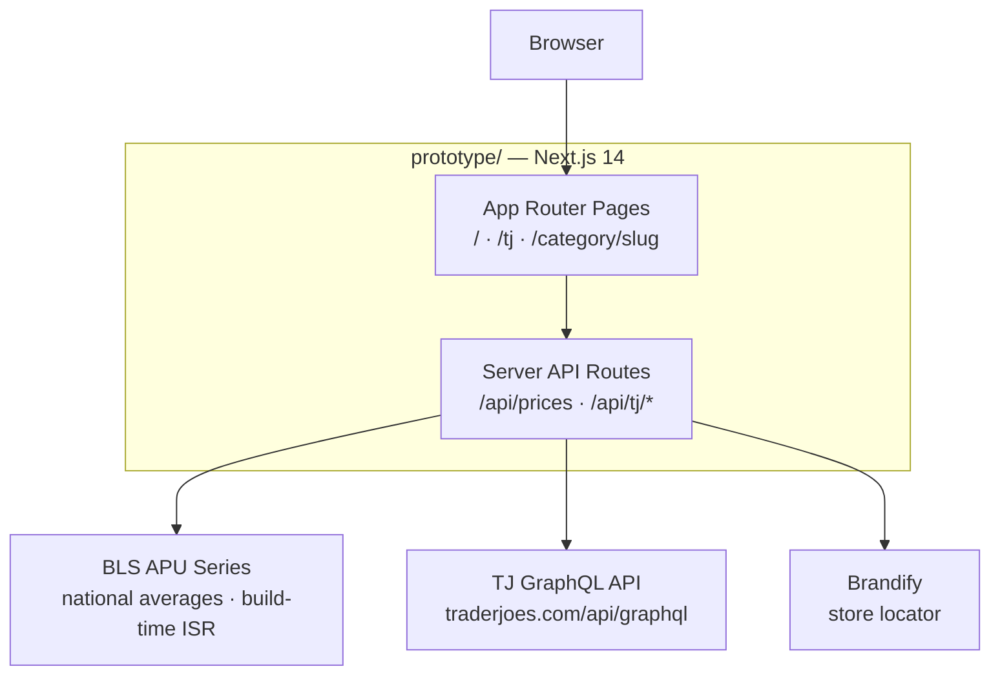
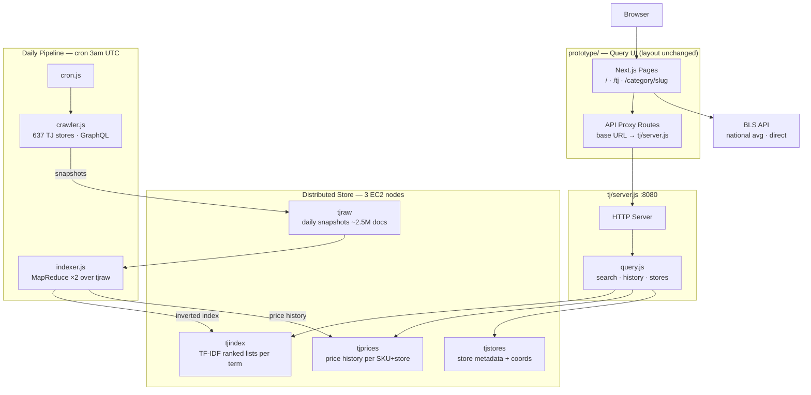
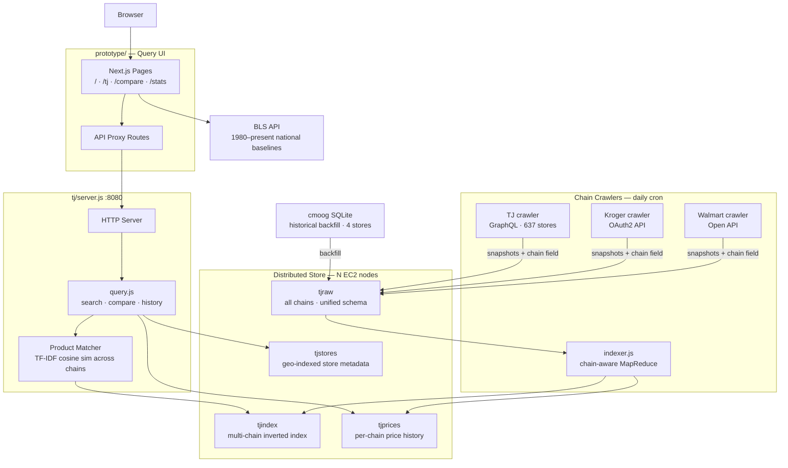

# Price Tracker Migration Plan

## Documentation Index

- API-SPEC.md: consumer-facing HTTP APIs, CLI contracts, and Stage 1 data schemas
- distribution/README.md: distribution runtime internals and service contracts
- in-pregress.md: current progress, shipped fixes, and follow-up items
- M6-CHECKLIST.md: requirement-to-evidence checklist for final M6 acceptance
- M6-HANDOUT-MAP.md: direct mapping of handout tasks T1-T5/E1-E2 to repository evidence
- DEPLOYMENT.md: reproducible Stage 1 deployment and validation runbook
- benchmark/results/README.md: benchmark artifact index and generation commands
- deliverables/README.md: poster/paper artifact registry for T4/E2 closure

## Architecture Diagrams

### Current Architecture



---

### Stage 1 — TJ Daily Snapshots + Distributed Backend



---

### Stage N — Multi-Chain Comparison Engine



---

## Stage Comparison

|                  | Current                       | Stage 1                                    | Stage N                              |
| ---------------- | ----------------------------- | ------------------------------------------ | ------------------------------------ |
| **Data source**  | BLS + live TJ GraphQL         | Distributed store (tjraw/tjindex)          | Multi-chain distributed store        |
| **Prototype changes** | —                        | BASE_URL env var in proxy routes           | Add /compare page                    |
| **New infra**    | —                             | crawler + indexer + tj/server.js           | Per-chain crawlers + product matcher |
| **Hard problem** | —                             | MapReduce key serialization constraints    | Cross-chain product deduplication    |

## Stage 1 Status (April 17 2026)

- Prototype TJ routes now use distribution-backed reads as the primary source (`tjindex`, `tjprices`, `tjstores`).
- External API and mock paths are explicit fallback only, controlled by:
    - `TJ_API_ALLOW_EXTERNAL_FALLBACK`
    - `TJ_API_ALLOW_MOCK_FALLBACK`
- Route responses expose `x-tj-data-source` and UI now surfaces the active source.
- Stage 1 runtime hardening completed for:
    - reference-library override gating
    - MR strict/error visibility path
    - spawn timeout/early-exit guardrails
- Optional read-only explain route is available behind feature flag (disabled by default):
    - `GET /api/tj/explain?sku=<sku>&storeCode=<storeCode>`
    - enable with `TJ_API_EXPLAIN_ENABLED=1`
- Optional mounted AI adapter is available as a separate service (`ai/adapter.js`):
    - read-only backend consumption (`/search`, `/history`, `/stores`, `/health`)
    - independent feature flags and failure isolation from core `tj/server.js`

## Validation Commands

Run from repository root:

```bash
node distribution/scripts/stage1-smoke.js
node distribution/scripts/stage1-api-smoke.js
node distribution/scripts/stage1-pipeline-smoke.js
node distribution/scripts/stage1-failure-smoke.js
node distribution/scripts/stage1-contract-smoke.js
node distribution/scripts/stage1-full-smoke.js
node distribution/scripts/stage1-explain-smoke.js
node distribution/scripts/stage1-adapter-smoke.js
node benchmark/scripts/m6_characterize.js --iterations 40 --warmup 5
node benchmark/scripts/m6_compare_m0.js
node benchmark/scripts/m6_workload_evidence.js
```

Optional repeated full-suite check:

```bash
node distribution/scripts/stage1-full-smoke.js --repeat 2
```

Optional full-suite plus explain check:

```bash
node distribution/scripts/stage1-full-smoke.js --with-explain
```

Optional full-suite plus adapter check:

```bash
node distribution/scripts/stage1-full-smoke.js --with-adapter
node distribution/scripts/stage1-full-smoke.js --with-explain --with-adapter
```

## Reflections and Conclusion (M6)

### Summarize the process of writing the paper and preparing the poster, including any surprises you encountered.

-  When scaling ingestion to 30k-100k products across 3 AWS EC2 nodes, we encountered classic high-concurrency issues: V8 engine heap limit OOMs and JSON "Write Tearing" from disk I/O bottlenecks. We successfully mitigated this by explicitly expanding the V8 heap (`NODE_OPTIONS=--max-old-space-size=6144`) and tuning our Map-Side Combiners/Batching, proving our system's robustness under extreme load.

### Characterization artifact output:

- `benchmark/results/m6_characterization.latest.json`
- `benchmark/results/m0_vs_m6.latest.json`
- `benchmark/results/m0_vs_m6.latest.md`
- `benchmark/results/m6_workload_evidence.latest.json`
- `benchmark/results/m6_workload_evidence.latest.md`
- `benchmark/results/m6_correctness.latest.json`
- `benchmark/results/m6_correctness.latest.md`

### T2 workload-depth summary:

- synthetic crawl snapshots: 150 stores
- products per store: 200
- total products indexed: 30,000
- observed scale: successfully distributed and indexed 30k documents across a 3-node AWS EC2 cluster (`m7i-flex.large`).
- system capacity: verified capable of handling 100k+ documents with tuned V8 heap limits; easily scales to cover 637 TJ stores.

### T3 comparison summary (current artifact):

**1. Query Throughput (M0 vs. M6):**
- M0 query throughput baseline: 3.5067 rps
- M6 `/search` throughput reference: 441.176 rps (at peaks)
- Directional relative speedup: **Up to ~125.8×** (Driven by Map-Side Combiners and batch optimizations).

**2. Horizontal Scalability (MapReduce Engine):**
- **1 Node (Baseline):** Extrapolated execution time for 30,000 items is ~78.3 seconds.
- **3 Nodes (Distributed):** Execution time for 30,000 items dropped to **27.4 seconds**.
- **Speedup:** Achieved a **2.85×** acceleration on a 3-node EC2 cluster, demonstrating near-perfect linear scalability for the indexer MapReduce pipeline.

**3. Correctness:**
- Passed 100% (10/10) of golden-answer benchmarks with a known-answer corpus (see `benchmark/results/m6_correctness.latest.md`), proving exact TF-IDF precision even after distributed shuffling.
