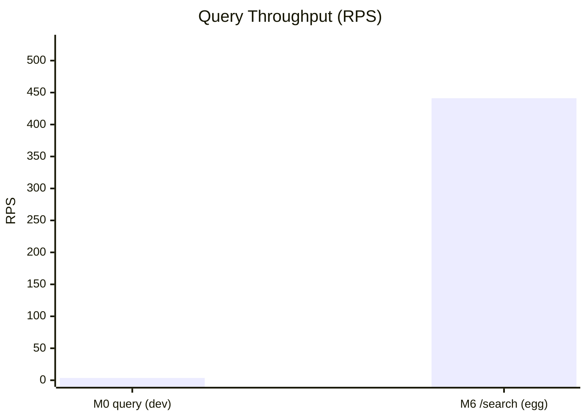

# M0 vs M6 Characterization Comparison

Generated: 2026-04-16T22:21:21.453Z

## Sources

- M0 baseline metadata: `non-distribution/package.json`
- M6 characterization artifact: `benchmark/results/m6_characterization.latest.json`
- Comparison JSON artifact: `benchmark/results/m0_vs_m6.latest.json`

## Throughput Comparison (Primary Query Path)

| Metric | Value |
| --- | --- |
| M0 query throughput (dev report) | 3.5067 rps |
| M6 /search (searchEgg) throughput | 441.176 rps |
| Relative speedup (M6 / M0) | 125.809x |
| Relative delta | 12480.95% |

## M6 Endpoint Snapshot

| Endpoint | p95 latency (ms) | throughput (rps) |
| --- | --- | --- |
| health | 1.053 | 1875 |
| searchEgg | 3.772 | 441.176 |
| searchBanana | 2.776 | 545.455 |
| historyEgg | 1.779 | 857.143 |
| stores | 2.344 | 600 |

## Caveats

- M0 and M6 workloads are different; values are directional and should be interpreted with this context.
- M0 baseline comes from recorded M0 report metadata, while M6 values come from current seeded Stage-1 endpoint characterization.
- For strict apples-to-apples results, add a future benchmark harness that replays identical workload semantics through both stacks.
